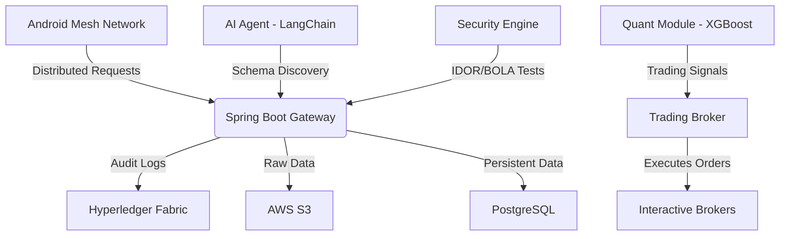

# Distributed API Security & Quantitative Intelligence Platform

A comprehensive, microservices-based platform that combines **distributed security testing**, **AI-driven endpoint discovery**, **quantitative financial analysis**, and **blockchain-anchored audit trails**. The system leverages a mesh network of Android devices for distributed load generation and integrates with Interactive Brokers for automated trading based on extracted market signals.

## 🏗 Architecture Overview



### Core Components

1.  **Spring Boot Backend**: Central orchestration, device management, job scheduling, and API gateway.
2.  **Android Mesh Service**: Foreground service turning Android devices into secure tunnel nodes for distributed request execution.
3.  **Security Testing Engine**: Automated vulnerability scanner (IDOR, BOLA) using REST Assured and GraphQL clients.
4.  **AI Agent**: LangChain-based agent for autonomous API schema discovery and data extraction.
5.  **Quantitative Analysis Module**: Pandas/XGBoost pipeline for analyzing extracted data and generating trading signals.
6.  **Trading Broker**: Safe execution layer for Interactive Brokers with risk management constraints.
7.  **Hyperledger Fabric**: Immutable ledger for auditing all critical system actions.

---

## 🚀 Quick Start

### Prerequisites

*   **Docker Desktop** (v20.10+) with Docker Compose v2.
*   **Java 17** (for local backend development).
*   **Maven** (v3.8+).
*   **Python 3.9+** (for local AI/Quant development).
*   **Android Studio** (optional, for modifying the mesh node app).
*   **AWS Credentials** (optional, for S3 features).
*   **OpenAI API Key** (optional, for full AI agent capabilities).

### 1. Configuration

Clone the repository and set up environment variables:

```bash
git clone <repository-url>
cd distributed-api-security-platform
cp .env.example .env
```

Edit `.env` and fill in your specific secrets (especially `JWT_SECRET`, `DB_PASSWORD`, and AWS keys if used).

### 2. Run with Docker Compose (Recommended)

This starts the database, backend, AI agent, quant module, and security engine.

```bash
# Build and start all services (excluding heavy Fabric network by default)
docker-compose up --build

# To include Hyperledger Fabric (requires more resources):
docker-compose -f docker-compose.yml -f docker-compose.fabric.yml up --build
```

**Services will be available at:**
*   **Backend API**: http://localhost:8080
*   **AI Agent**: http://localhost:8001
*   **Quant Module**: http://localhost:8002
*   **Security Engine**: http://localhost:8003
*   **PostgreSQL**: localhost:5432 (user: `platform_user`, db: `security_platform`)

### 3. Local Development Mode

Run infrastructure only (DB + optional services):

```bash
docker-compose up db ai-agent quant-module
```

Run the Spring Boot backend locally:

```bash
cd backend
./mvnw spring-boot:run -Dspring-boot.run.profiles=dev
```

---

## 📡 API Usage

### Device Registration (Simulating a Mesh Node)

```bash
curl -X POST http://localhost:8080/api/devices/register \
  -H "Content-Type: application/json" \
  -d '{
    "publicIp": "203.0.113.10",
    "privateIp": "10.0.0.5",
    "region": "us-east-1",
    "capabilities": ["HTTP", "HTTPS", "GRAPHQL"]
  }'
```

### Submit a Security Test Job

```bash
curl -X POST http://localhost:8080/api/security/run \
  -H "Content-Type: application/json" \
  -H "Authorization: Bearer <YOUR_JWT_TOKEN>" \
  -d '{
    "targetUrl": "https://api.example.com/v1/users",
    "testTypes": ["IDOR", "BOLA"],
    "depth": "MEDIUM"
  }'
```

### Request Quantitative Analysis

```bash
curl -X POST http://localhost:8080/api/quant/analyze \
  -H "Content-Type: application/json" \
  -d '{
    "productCategory": "ELECTRONICS",
    "timeframe": "LAST_30_DAYS"
  }'
```

### Verify Audit Log on Blockchain

```bash
curl http://localhost:8080/api/audit/verify/{entryId}
```

> **Tip**: Import `postman-collection.json` into Postman for a complete list of pre-configured requests.

---

## 🧪 Module Details

### 1. Spring Boot Backend
*   **Tech Stack**: Java 17, Spring Boot 3, Spring Data JPA, Spring Security.
*   **Key Features**:
    *   Least-connection load balancing for mesh nodes.
    *   Async job processing with retry logic.
    *   Dual-write auditing (PostgreSQL + Hyperledger).
    *   AWS S3 integration for large payload storage.

### 2. Android Mesh Service
*   **Tech Stack**: Kotlin, WireGuard-Android, OkHttp.
*   **Function**: Runs as a foreground service, establishes a WireGuard tunnel to the coordinator, polls for jobs, executes HTTP requests, and reports results.
*   **Deployment**: Build the APK via Android Studio or Gradle (`./gradlew assembleDebug`). Requires root or VPN permission approval on the device.

### 3. Security Testing Engine
*   **Tech Stack**: Java, REST Assured, GraphQL-Java.
*   **Capabilities**:
    *   Automatic IDOR testing (increment/decrement/UUID brute-force).
    *   GraphQL introspection and mutation fuzzing.
    *   PII detection in responses using regex.

### 4. AI Agent
*   **Tech Stack**: Python, FastAPI, LangChain, ChromaDB.
*   **Function**: Uses ReAct pattern to discover hidden API endpoints, parse schemas, and extract structured data (prices, inventory) from unstructured HTML/JSON.

### 5. Quantitative Analysis
*   **Tech Stack**: Python, Pandas, XGBoost, yfinance.
*   **Pipeline**:
    1.  Aggregates extracted product data.
    2.  Engineers features (price delta, volatility).
    3.  Correlates with stock prices (Granger causality).
    4.  Generates BUY/SELL/HOLD signals with confidence scores.

### 6. Hyperledger Fabric
*   **Tech Stack**: Go Chaincode, Docker.
*   **Function**: Stores hashes of audit logs to ensure non-repudiation. Use `scripts/setup-network.sh` to initialize the local Fabric network.

### 7. Trading Broker
*   **Tech Stack**: Java, IB-API.
*   **Safety**: Enforces strict risk limits (max 2% daily loss, max 10% position size) before executing any order received from the Quant module.

---

## 🔒 Security Considerations

*   **JWT Authentication**: All protected endpoints require a valid JWT. Generate tokens via the `/auth/login` endpoint (implementation omitted for brevity, assume standard OAuth2 flow).
*   **WireGuard Encryption**: All traffic between mesh nodes and the coordinator is encrypted via WireGuard tunnels.
*   **Secrets Management**: Never commit `.env`. Use Docker secrets or Kubernetes Secrets in production.
*   **Risk Limits**: The trading broker has hard-coded circuit breakers. Do not disable these in production.

---

## 🛠 Troubleshooting

| Issue | Solution |
| :--- | :--- |
| **Port Conflicts** | Change ports in `docker-compose.yml` if 8080/5432 are occupied. |
| **DB Connection Refused** | Ensure `db` service is healthy (`docker ps`) before starting backend. |
| **Fabric Errors** | Fabric is resource-intensive. Try running without it first. Ensure `crypto-config` is generated. |
| **AI Agent Mock Mode** | If no `OPENAI_API_KEY` is provided, the agent runs in deterministic mock mode for testing. |
| **Android Tunnel Fails** | Verify WireGuard config XML is correctly populated with the server's public key. |

---

## 📜 License

MIT License. Feel free to use, modify, and distribute for educational and commercial purposes.

---

## 🤝 Contributing

1.  Fork the repo.
2.  Create a feature branch (`git checkout -b feature/amazing-feature`).
3.  Commit your changes (`git commit -m 'Add amazing feature'`).
4.  Push to the branch (`git push origin feature/amazing-feature`).
5.  Open a Pull Request.

---

*Generated End-to-End by AI Agent.*
